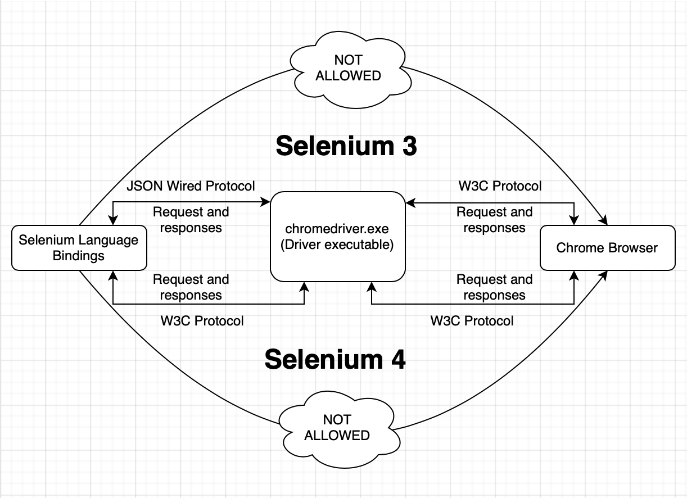
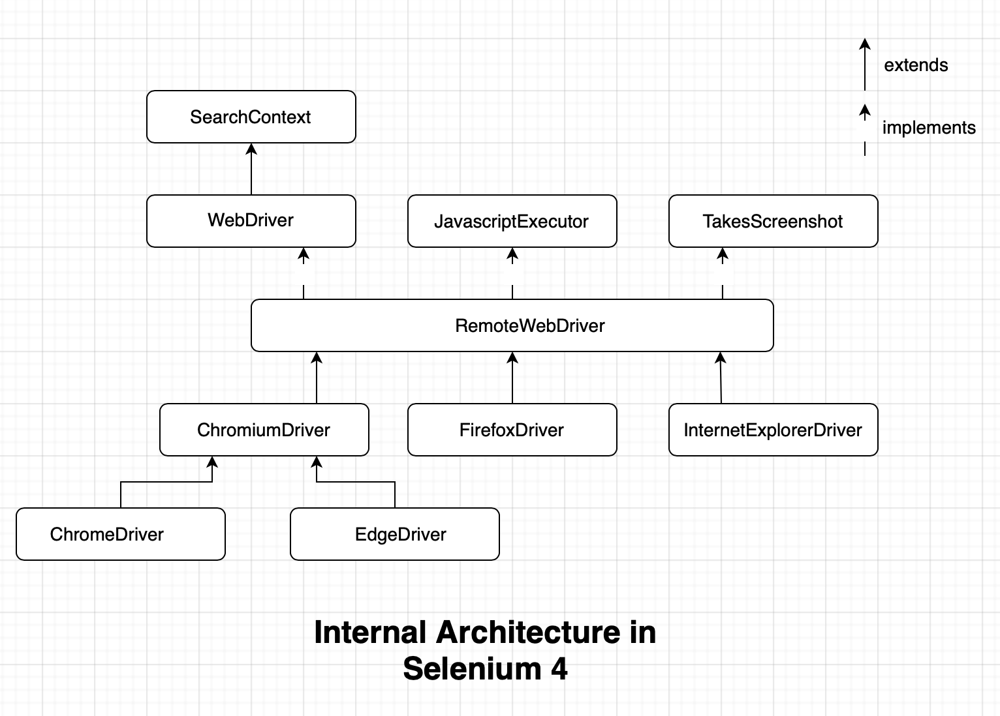
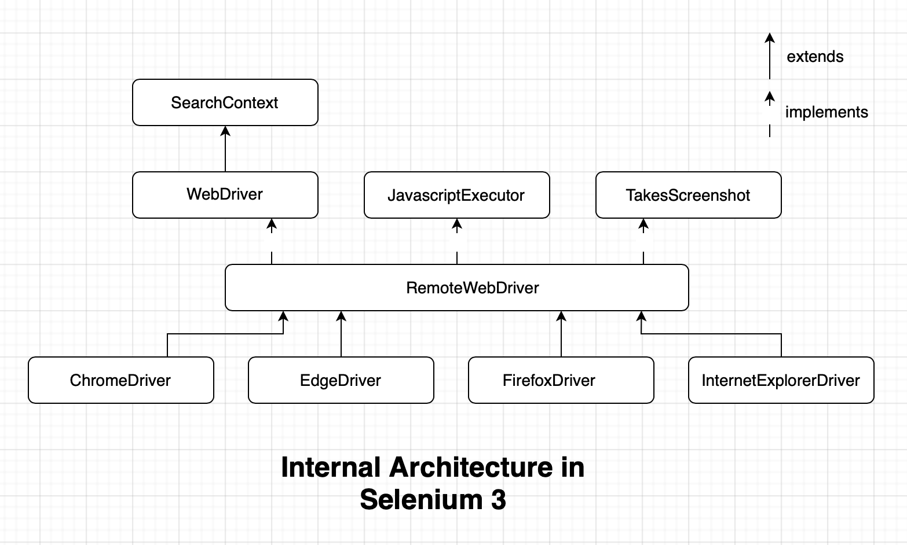
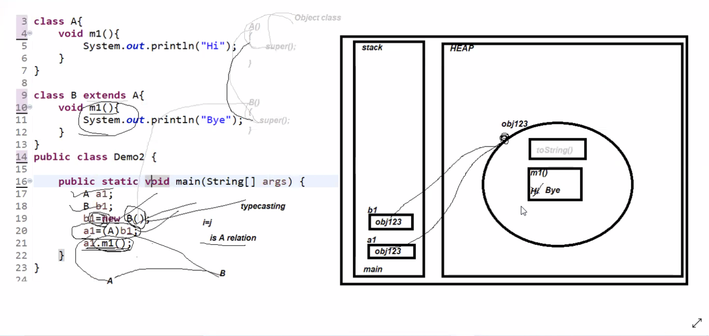

# NOTES - Test Automation with Selenium WebDriver

## Selenium Syllabus

- Automation Testing
  - What is Automation Testing?
  - When we Switch to Automation Testing?
  - Why Automation testing?
  - Advantages &  Disadvantages
  - Automation Testing Tools

- Selenium
  - What is Selenium?
  - Advantages of Selenium
  - Java-Selenium Architecture
  - Basic Selenium Program
  - Runtime Polymorphism Program in Selenium
  - WebDriver Functions
  - Locators
  - XPath, its types and cases
  - WebElement Functions
  - Check points
  - Handling Multiple Elements
  - Handling Synchronization
  - Implicit
  - Explicit
  - Custom wait
  - Blind wait
  - Handling Dropdown (static and dynamic)
  - Handling Keyboard and Mouse Actions
  - Taking Screenshot
  - Handling Disabled Element
  - Performing Scroll down Action
  - Handling Popups (web-based and Window-based)
  - Handling Frames
  - Handling New Windows/New Tabs
  - Encapsulation in Selenium
  - Creating Test Class

- Automation Framework
  - Stages and Types of Framework
  - POM (Page Object Model)
  - Handling Excel
  - TestNG
  - TestNG Annotations
  - Reporting
  - TestNG Suite
  - Assertion
  - Grouping
  - DataProvider
  - Parallel Execution
  - Maven
  - GitHub
  - Jenkins
  - Hybrid Framework
  - Designing Framework
  - Hybrid Framework Architecture
  - Framework implementation
  - Framework execution

## Brief Overview of Java Fundamentals

- Object Oriented Programming Fundamentals
  - Class: A blueprint
  - Object: Used to create multiple copies of the blueprint
  - Method: A block of code which performs a particular task
    - Static: Part of the class, common/shared copy accessible by all instances
    - Non-static: Part of the object, single copy accessible by each object of the class
  - Inheritance: Receiving properties from ancestor/parent class to child class
  - Abstraction: Disclosing only the important details, hiding internal implementation (e.g. we just type on a keyboard and don't know how internally the letter 'A' appears on screen)
  - Polymorphism: Behavior changes based on the situation (e.g. car can be used to take people from one place to another, it can also be used to take goods and furniture one place to another)
    - Compile-time Polymorphism: Method Overloading, binding of method call and the method body at the compile-time
    - Runtime polymorphism: Method Overriding, binding of method call and the method body at the run-time
- Data-types (int, float, double etc which can store single piece of data; arrays which can store multiple pieces of information but with a limitation that size of it can't be altered and it allows to store only one type of data/homogenous data)
- Collections
  - List
  - Set
  - Queue
  - Map
- String: Its a class, it's objects are immutable in nature

## Introduction to Selenium

### What is Automation?

Automation is performing any task using any system or tool without any manual intervention.

### What is Selenium?

- Selenium is a free and open source web application automation tool.
- Free: Need not to pay for the license [https://www.selenium.dev/downlods]. We can use it to automate an application, we can use it for teaching purpose, we can use selenium give services to anyone an can take money out of him without paying back to the selenium community.
- Open source: We can see the source code, we can download the source code, we can customize the source code (e.g. Unix, Java, Android etc.), integration with third party tools will be very very easy (Maven, Git, Jenkins etc.)

### Features of Selenium:

- An automation tool.
- It is a package/API.
- It is open-source.
- Used to automate Web applications that runs on a browser.
- Supports multiple languages - Java, Python, C#, JavaScript, Ruby, PHP etc. [Note: there is no dependency between the development language and the automation language, the application can be developed in React, Angular but it can be automated using Java-Selenium. But if you use the language with which the application is built, then the advantage is development and testing environments will be similar and chances are there that you may get some help from the development team].
  - More number of test engineers can be hired.
  - Transition from one language to another can be smooth (A person who knows Java-Selenium, can easily learn Python-Selenium).
- Entire code of selenium is written in Java, as its platform independent.
  - Hence we can indirectly say that Selenium runs on all the operating systems and browsers (wherever support is added) and so it's easy for doing compatibility testing (cross browser and cross platform testing).
  - Hence it's cost effective (e.g. QTP's license cost money + Windows OS license also costs money, whereas Selenium and linux can be used totally free of cost).
- Limitation of Selenium is it can be used only to automate Web Applications (standalone applications like Calculator, desktop applications like Microsoft Word/Excel/Powerpoint, mobile applications like Instagram and client/server applications like Zoom can't be automated).

### Installation of Selenium

- Requirements:
  - JDK (v 1.8 or above) [https://www.oracle.com/java/technologies/downloads/]
    - JDK should be installed and path should be added in System Environment Variables (Windows)
    - JDK should be installed and path should be added in .bashrc or .zshrc file present in home directory (Linux/Mac)
    - To check proper installation of JDK enter commands `javac -version` and `java -version`
  - Eclipse (or any IDE that supports Java e.g. IntelliJ/NetBeans) [https://www.eclipse.org/downloads/packages/]
  - Selenium JAR file [https://www.selenium.dev/downloads/]. Previous releases can be found in [https://github.com/SeleniumHQ/selenium/releases]
  - Driver executable for different browsers [https://www.selenium.dev/downloads/]
  - Browsers in which you want to automate the web applications

- Installation:
  - Create a Java Project
  - Create a directory under the Java Project and give it a name (Steps: Java Project -> `New` -> `Folder` -> Specify the name, for example 'lib' -> `Finish`)
  - Copy the Selenium JAR file and paste it in 'lib' directory
  - Right click on the Selenium JAR file present in 'lib' directory -> `Build Path` -> `Add to Build Path` (Selenium JAR file should also be displayed under `Referenced Libraries`)
  - Write a sample Java code as shown below and run it (Note: Running this code will throw an exception - IllegalStateException)

    ```java
    public class Demo1 {
        public static void main(String[] args) {
            ChromeDriver driver = new ChromeDriver();
        }
    }
    ```

  - Download the driver executable for the browser you want to automate from the link given above. Extract the zip file to get the executable file e.g. chromedriver.exe, geckodriver.exe etc.
  - Create a folder 'driver' under the Java Project -> Copy and paste the driver executable file into this 'driver' directory.
  - Then complete writing rest of the code as shown below:

  ```java
    public class Demo1 {
        public static void main(String[] args) {
            String key = "webdriver.chrome.driver";
            // . (dot) in chromedriver.exe path means current java project
            String value = "./driver/chromedriver.exe";
            System.setProperty(key, value);

            ChromeDriver driver = new ChromeDriver();
            driver.get("https://www.google.com");
        }
    }

- Additional Notes:
  - Take a screenshot of the entire window `PrintScrn` (Windows)
  - To capture your entire screen and automatically save the Screenshots folder, tap the `Windows + PrintScrn` key. Your screen will briefly go dim to indicate that you've just taken a screenshot, and the screenshot will be saved to the Pictures > Screenshots folder.
  - Take a screenshot of a small part of the window `Windows + Shift + S` (Windows)
  - Take a screenshot of the entire window `Command + Shift + 3` (Mac)
  - Take a screenshot of a small part of the window `Command + Shift + 4` (Mac)
  - IDE stands for Integrated Development Environment which is a place for all development activity, where we can write code, compile code, run code, debug our code and if needed we can also push it to version control systems like GitHub, BitBucket etc.
  - To call methods of a class, or create the object of a class present in different package we either need to import the class or use fully qualified class name.
  - Specifying a class name including its package name is known as fully qualified class name (e.g. java.util.Scanner, where Scanner is the classname and java.util is the package name inside which this class is available)
  - For security reasons browser can't allow anyone to write any code using any programming language and directly run it on the browser. Because chances are there they can easily hack the browser and the web application injecting malware, trojan or virus. Hence, they came up with a middle man, that is, driver executable. One of the driver executable is 'chromedriver.exe' which is developed by people working for Selenium and Google Chrome. Now, sending the request from Selenium to browser directly (which will create a security issue), Selenium will send a request to driver executable and driver executable will send the request to Chrome browser. Browser will trust the request of 'chromedriver.exe' because it's also developed by Google Chrome people. Once the request is processed Chrome browser will send the response to driver executable, driver executable will convert the response to selenium understandable format and will send it back to Selenium.
  - Driver executables are vendor specific, that means, Google Chrome, Firefox, Opera, Safari, Internet Explorer, Edge etc all of them have their very own driver executables to communicate with their browser.
  - In previous versions of Selenium (< v4.0) the communication between Selenium and the driver executable used to happen using JSON wired protocol and communication between driver executable and browser used to happen using W3C (World Wide Web Consortium) protocol.
  
    `Selenium` <--(_JSON Wired Protocol_)--> `Driver Executable` <--(_W3C Protocol_)--> `Browser`
  
    But, in Selenium v4.0 onwards the complete communication between Selenium, driver executable and browser, takes place using W3C (World Wide Web Consortium) protocol.

    `Selenium` <--(_W3C Protocol_)--> `Driver Executable` <--(_W3C Protocol_)--> `Browser`
  
  - Diagram:
  

  - Earlier there was a lot of delay in converting request and responses from one protocol to another (JSON Wired to W3C and W3C to JSON Wired). Now because in both the places W3C protocol is being used so the time consumption is less, performance is improved and test-cases in turn will have more stability.
  - Inside the constructor call new ChromeDriver() Selenium people has written a code to search for the path of driver executable. Hence you need to provide the path of the driver executable either in the PATH environment variable of the system, or programmatically within the program by using `System.setProperty(key, value);`. Selenium will first search for the driver executable path in PATH environment variable, then it will search in the value of the key (e.g. webdriver.chrome.driver) in `System.setProperty(key, value);`, even then if it is not found finally it will throw IllegalStateException.
  - Manually setting the driver executable path by going to the 'System Environment Variable' is always discouraged, because this way every other test engineer working in team has to follow the same way and chances are there that a newcomer may miss-out on doing this additional configuration - as a result program may start failing in his/her system. Hence, we should always set the driver executable path programmatically and keep the driver executable file inside the project.
  - One more thing to remember is we should always use relative path of the driver executable while setting it up programmatically using `System.setProperty(key, value);`. Because, even if we are keeping the driver executable within the project, path of the driver executable may vary from one system to another if we use absolute path of the driver.
  - Key present in `System.setProperty(key, value);` is case-sensitive and varies from one browser to another. For example, key for Chrome browser is 'webdriver.chrome.driver' and key for Firefox browser is 'webdriver.gecko.driver'
  - We should always set the path of the driver executable before opening the browser, that is, before `new ChomeDriver()` constructor call. Best practice is to define the path of the driver executable programmatically within the static block, because static block is executed as soon as the class gets loaded.
  - Any program that we want to run once and as soon as the class gets loaded, we may put that in static block. The static blocks are best used for initialization of static final variables (especially when the initialization requires a complicated computation which may occupy multiple lines of code).

    ```java
    public class Demo2 {
        static final int i;
        static {
            int j = 0;
            for (int p = 0; p < 10; p++)
                j = p + j;

            i = j;
        }

        public static void main(String[] args) {
            System.out.println(i);
        }
    }
    ```

  - Static block may or may not get executed before the main() method, it all depends on the situation. An example where one static block gets executed before the main() method and another static block gets executed after the execution of main() method is given below:

    ```java
    class P {
        static {
            System.out.println("Static");
        }
    }

    public static A {
        // Because the main() method is present inside class A, hence class A will be loaded first
        static {
            System.out.println("Main static");
        }

        public static void main(String[] args) {
            System.out.println("Main");
            P p1 = new P();
        }
    }
    ```

    ```log
    Main static
    Main
    Static
    ```

## Internal Architecture of Selenium WebDriver

- Selenium is open-source, that means, anyone can see the source code, download it and customize it according to their need.
- We can see the source code of Selenium 4 visiting the URL: [https://github.com/SeleniumHQ/selenium]
- We can see the source code of Selenium 3 visiting the URL: [https://github.com/SeleniumHQ/selenium/tree/selenium-3.141.59]
- Super most interface is SearchContent and most frequently used interface is WebDriver.
- Diagram:



## Runtime Polymorphism and Compatibility Testing

### Runtime Polymorphism in Java

- Example of Runtime polymorphism is shown below:

    ```java
    class A {
        void m1() {
            System.out.println("Hi");
        }
    }

    class B extends A {
        void m1() {
            System.out.println("Bye");
        }
    }

    public class Demo2 {
        public static void main(String[] args) {
            A a1 = new A();
            a1.m1();

            B b1 = new B();
            b1.m1();

            // Runtime polymorphism
            A a2;
            B b2;
            b2 = new B();
            // a2 = (A) b1;
            a2 = b1;            // Auto-upcasting
            a2.m1();
        }
    }
    ```

    ```log
    Hi
    Bye
    Bye
    ```

- Diagram:


- Additional Notes:
  - In Java we have two types of memory - stack and heap. Stack is used for execution, heap is used for storage and for every thread one stack is created.
  - Compiler will write a constructor for us if there is no constructor that is known as default constructor. Default constructor is always no argument constructor. Whenever any class is extending another class compiler will add super() call statement inside the child class constructor - which will load non-static members of the parent class.
  - Loading of all non-static properties and methods into the object will start from top to bottom, i.e. parent class's members will be loaded in memory first then the properties of the child class will be loaded (class Object -> class A -> class B). Hence in the above example, a2.m1() will call the method m1() which is overridden in the object.
  - For upcasting we should have IS-A relationship between two classes.

### Use of Runtime Polymorphism in Selenium

## List of Exceptions

| Exception                                         | Reason                                                                 |
| :------------------------------------------------ | :--------------------------------------------------------------------- |
| java.lang.IllegalStateException                   | Driver executable path is incorrect or not found                       |
| org.openqa.selenium.SessionNotCreatedException    | Version mismatch between browser version and driver executable version |
| org.openqa.selenium.InvalidArgumentException      | If the protocol (http/https) is not defined in the URL                 |

## New Features of Selenium 4

| Selenium 3                                          | Selenium 4                                                                             |
| :-------------------------------------------------- | :------------------------------------------------------------------------------------- |
| JSON Wired Protocol                                 | W3C Protocol (Communication between Selenium language bindings and driver executable)  |
| Filename: selenium-server-standalone-3.141.59.jar   | Filename: selenium-server-4.1.1.jar                                                    |
| EdgeDriver and ChromeDriver extends RemoteWebDriver | EdgeDriver and ChromeDriver extends ChromiumDriver                                     |

One time setup to hide the methods getting inherited from from Object class:
Window -> Preferences -> Java -> Appearances -> Type Filters -> Add -> java.lang.Object -> OK

https://demo.actitime.com/login.do
https://opensource-demo.orangehrmlive.com